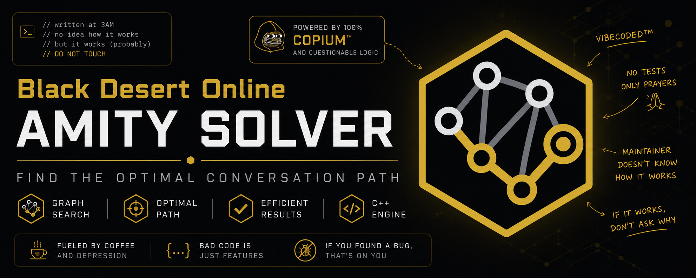

<p align="center">
  
</p>

# Black Desert Online Amity Solver

Small C++17 solver for Black Desert Online's Amity conversation minigame. Selects and orders knowledge to maximize goal success probability, then expected favor.

[](https://github.com/abertry/bdo-amity/actions/workflows/cmake.yml)


Supports spark, failure, Maximum Favor Level, Accumulated Favor Level, and free-talk goals.
Favor and interest combo effects support delayed activation, finite duration, and overlap.

Observed conversation mechanics modeled by solver:

- Spark chance is topic Interest Level divided by NPC Interest Level, capped at 100%.
- Successful topics gain at least 1 favor.
- Maximum Favor Level is running favor total and resets after failed spark.
- Accumulated Favor Level adds current Maximum Favor Level after each successful topic.
- Timed combo effects can modify NPC or topic Favor and Interest Level.

Exact formula for community-observed success/failure "momentum" is not known, so solver does
not invent or apply one. Knowledge database currently contains base topic values; combo metadata
can be supplied through `Knowledge::comboEffects` as verified data becomes available.

## Build and test

```bash
cmake -S . -B build -DBUILD_TESTING=ON
cmake --build build
ctest --test-dir build --output-on-failure
```

## Usage

```bash
./build/amity_solver --interest 30 --favor 15 --slots 8 \
  --category "Residents of Velia" --goal consecutive-spark --target 3
```

Use `--help` for all options or `--list-categories` for available knowledge.

## Sources

Official documentation:

- [Black Desert NA/EU Adventurer's Guide: Amity](https://www.naeu.playblackdesert.com/en-US/Wiki?wikiNo=24)

Community guides and recorded observations used to reconstruct formulas:

- [Reddit: Amity and conversations, the math behind it](https://www.reddit.com/r/blackdesertonline/comments/46xbfc/semiguideamity_and_conversations_the_math_behind/)
- [Black Desert Foundry: Amity & Conversation Guide](https://www.blackdesertfoundry.com/story-exchange-guide/)
- [Steam Community: Conversation/Amity for dummies](https://steamcommunity.com/sharedfiles/filedetails/?id=2476369608)

Community observations can be incomplete or version-dependent. Solver implements mechanics
supported by repeatable examples and keeps unresolved behavior documented as unknown.

Not affiliated with Pearl Abyss Corp. Black Desert Online is a trademark of Pearl Abyss Corp.
