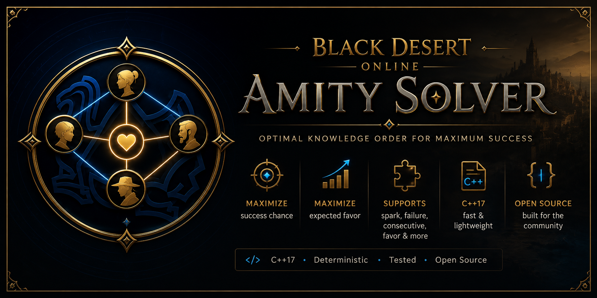

<p align="center">
  
</p>

# Black Desert Online Amity Solver

Small C++17 solver for Black Desert Online's Amity conversation minigame. Selects and orders knowledge to maximize goal success probability, then expected favor.

[](https://github.com/abertry/bdo-amity/actions/workflows/cmake.yml)


Supports spark, failure, favor, and free-talk goals. Combo effects are not yet supported.

## Build and test

```bash
cmake -S . -B build -DBUILD_TESTING=ON
cmake --build build
ctest --test-dir build --output-on-failure
```

## Usage

```bash
./build/amity_solver --interest 30 --favor 15 --slots 8 \
  --category "Residents of Velia" --goal consecutive-spark --target 3
```

Use `--help` for all options or `--list-categories` for available knowledge.

Not affiliated with Pearl Abyss Corp. Black Desert Online is a trademark of Pearl Abyss Corp.